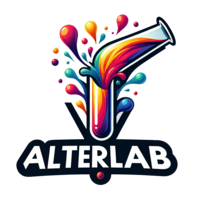
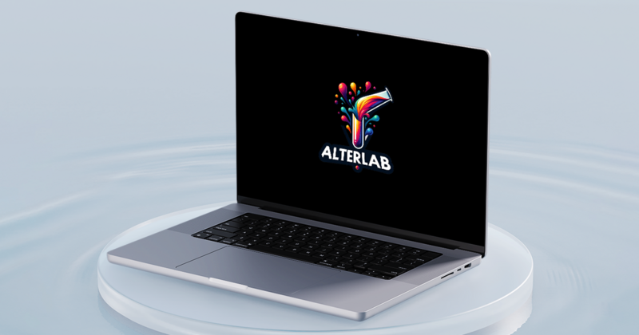
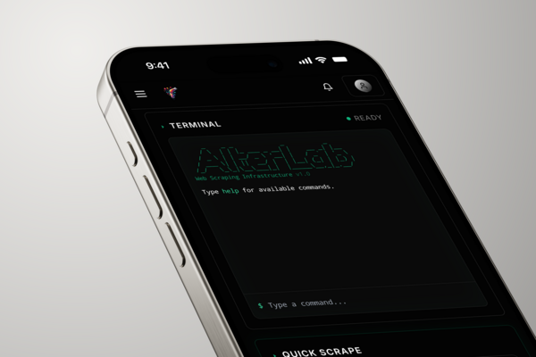

<p align="center">
  
</p>

<h1 align="center">n8n-nodes-alterlab</h1>

<p align="center">
  <strong>Web scraping node for n8n with anti-bot bypass, JavaScript rendering, and structured data extraction.</strong>
</p>

<p align="center">
  <a href="https://www.npmjs.com/package/n8n-nodes-alterlab"></a>
  <a href="https://www.npmjs.com/package/n8n-nodes-alterlab"></a>
  <a href="https://github.com/RapierCraft/n8n-nodes-alterlab/actions/workflows/ci.yml"></a>
  <a href="https://github.com/RapierCraft/n8n-nodes-alterlab/blob/main/LICENSE"></a>
</p>

<p align="center">
  <a href="https://app.alterlab.io/signin?redirect=/dashboard/keys&source=n8n&utm_source=n8n&utm_medium=integration&utm_campaign=community_node"><strong>Get Started Free →</strong></a> &nbsp; $1 free balance on signup — up to 5,000 scrapes.
</p>

---

<p align="center">
  
</p>

## Why Use AlterLab Instead of the HTTP Request Node?

The n8n HTTP Request node works for simple APIs but fails on real-world websites. It cannot bypass Cloudflare, DataDome, PerimeterX, or Akamai. It cannot render JavaScript. It cannot solve CAPTCHAs.

AlterLab replaces chains of Browserless, proxy rotators, and custom retry logic with **one node**:

| Capability | HTTP Request Node | AlterLab Node |
|---|---|---|
| Anti-bot bypass (Cloudflare, DataDome, Akamai) | No | Yes — automatic |
| JavaScript rendering (React, Angular, Vue SPAs) | No | Yes — full Chromium |
| Structured data extraction (JSON, Schema.org) | No | Yes — built-in profiles |
| Smart tier escalation (cheapest method first) | N/A | Yes — saves 60-80% vs browser-only |
| Residential proxy rotation | No | Yes — 195+ countries |
| Screenshot and PDF capture | No | Yes |
| OCR text extraction from images | No | Yes |

## How Does AlterLab Web Scraping Work?

AlterLab uses a multi-tier scraping architecture that automatically selects the cheapest method capable of fetching each URL:

1. **Curl** ($0.0002/req) — Direct HTTP for static pages, RSS feeds, public APIs
2. **HTTP** ($0.0003/req) — TLS fingerprint rotation for moderately protected sites
3. **Stealth** ($0.0005/req) — Browser impersonation for Cloudflare/DataDome-protected sites
4. **Light JS** ($0.0007/req) — Lightweight JS extraction from server-rendered HTML
5. **Browser** ($0.001/req) — Full headless Chromium for JavaScript-heavy SPAs

Auto mode starts at Tier 1 and escalates only when blocked. Most websites resolve at Tiers 1-2, so **$1 gets you 1,000 to 5,000 scrapes** depending on the sites you target.

<p align="center">
  
</p>

## Installation

### Install from n8n UI

In your n8n instance: **Settings → Community Nodes → Install → `n8n-nodes-alterlab`**

### Install via CLI

```bash
npm install n8n-nodes-alterlab
```

### Connect Your Account

**Option A — One-click OAuth (recommended):**
1. Add an AlterLab node to your workflow
2. Click the credential dropdown → **Create New → AlterLab OAuth2 API**
3. Click **Connect** → sign in → done. No API key copy-paste needed.

**Option B — API key:**
1. [Sign up free](https://app.alterlab.io/signin?redirect=/dashboard/keys&source=n8n&utm_source=n8n&utm_medium=integration&utm_campaign=community_node) and copy your API key
2. In n8n: **Credentials → New → AlterLab API** → paste key

## Quick Start — Scrape a Page in 30 Seconds

1. Add the **AlterLab** node to any workflow
2. Enter a URL (e.g., `https://www.amazon.com/dp/B0BSHF7WHW`)
3. Run

The node returns markdown, structured JSON, raw HTML, and metadata in a flat JSON object — ready for the next node in your workflow:

```
{{ $json.markdown }}            → Clean markdown (best for LLMs and AI agents)
{{ $json.text }}                → Plain text
{{ $json.json }}                → Structured data (Schema.org, extracted fields)
{{ $json.html }}                → Raw HTML
{{ $json.title }}               → Page title
{{ $json.filteredContent }}     → Custom schema extraction results
{{ $json.billing.cost }}        → Amount charged from your balance
{{ $json.billing.tier }}        → Scraping method used (curl, http, stealth, etc.)
{{ $json.billing.suggestion }}  → Cost optimization tip
{{ $json.screenshotUrl }}       → Screenshot URL (if enabled)
{{ $json.pdfUrl }}              → PDF URL (if enabled)
```

## What Can You Scrape with AlterLab?

### E-Commerce Product Data (Amazon, Walmart, Shopify)

Scrape Amazon, Walmart, Target, Best Buy, Shopify stores, and any product page. The **Product** extraction profile returns structured JSON: product name, price, currency, rating, review count, availability, image URLs, and description.

### News Articles and Blog Content

Scrape news sites, blogs, and publications. The **Article** extraction profile returns: title, author, published date, body text as clean markdown, and featured image URL. Markdown output is optimized for LLM context windows.

### Job Board Listings (Indeed, LinkedIn, Glassdoor)

Scrape Indeed, LinkedIn job posts, Glassdoor, and company career pages. The **Job Posting** profile returns: job title, company, location, salary range, description, and requirements as structured JSON.

### Any Website with Custom Extraction

Define a JSON Schema for your exact output structure, or write a natural language extraction prompt like *"extract the price, title, and all review texts as an array"*. AlterLab maps page content to your schema automatically.

<p align="center">
  
</p>

## n8n Workflow Examples

### Price Monitoring Automation

```
Schedule → AlterLab (Product profile) → Compare to Google Sheet → IF price dropped → Slack notification
```

Monitor competitor prices daily. AlterLab handles anti-bot protection on e-commerce sites. Compare extracted prices against stored values and alert your team when prices change.

### AI-Powered Content Pipeline

```
Schedule → AlterLab (Article profile, Markdown output) → OpenAI Summarize → Notion Database
```

Scrape industry news sources, get clean markdown (not messy HTML), summarize with GPT-4, and store in your knowledge base. AlterLab's markdown output is token-efficient for LLM processing.

### Lead Generation from Job Boards

```
Schedule → AlterLab (Job Posting profile) → Filter by keywords → Airtable → Email notification
```

Monitor job boards for roles that match your product. Extract structured listings, filter for relevant titles, and push qualified leads to your CRM.

### Competitor Intelligence Dashboard

```
Schedule → AlterLab (Custom schema) → Compare to previous scrape → Google Sheets → Looker Studio
```

Scrape competitor pages weekly. Define a custom schema for the data points you care about (pricing, features, team size). Track changes over time in a dashboard.

### Real Estate Listing Monitor

```
Schedule → AlterLab (Custom schema) → IF new listing → Telegram notification
```

Monitor property listing sites for new entries matching your criteria. Extract price, location, square footage, and images. Get notified the moment a matching property appears.

## Pricing — Pay-As-You-Go Web Scraping

No subscriptions. No monthly minimums. Add balance and use it whenever you need it.

### Base Scraping Costs

| Tier | Cost per Request | Use Case |
|---|---|---|
| Curl | $0.0002 | Static pages, RSS feeds, public APIs |
| HTTP | $0.0003 | Sites with basic TLS fingerprinting |
| Stealth | $0.0005 | Cloudflare, DataDome, PerimeterX protected sites |
| Light JS | $0.0007 | Server-rendered pages needing JSON extraction |
| Browser | $0.001 | Full JavaScript SPAs (React, Angular, Vue) |

### Optional Add-Ons

| Add-On | Extra Cost per Request | Description |
|---|---|---|
| JavaScript Rendering | +$0.0006 | Headless Chromium for dynamic content |
| Screenshot Capture | +$0.0002 | Full-page PNG screenshot |
| PDF Export | +$0.0004 | Rendered page as downloadable PDF |
| OCR Text Extraction | +$0.001 | Extract text from images on the page |
| Premium Residential Proxy | +$0.0002 | Geo-targeted proxy (US, DE, GB, JP, and 190+ more) |

## Node Reference

### Input Parameters

| Parameter | Required | Default | Description |
|---|---|---|---|
| **URL** | Yes | — | The webpage URL to scrape |
| **Mode** | No | `auto` | Scraping mode: `auto`, `html`, `js`, `pdf`, `ocr` |

### Advanced Options

| Option | Description |
|---|---|
| **Extraction Profile** | Pre-built schemas: Product, Article, Job Posting, FAQ, Recipe, Event |
| **Extraction Prompt** | Natural language instructions for custom data extraction |
| **Extraction Schema** | JSON Schema definition for structured output |
| **Render JavaScript** | Enable full Chromium rendering for SPAs and dynamic content |
| **Screenshot** | Capture a full-page PNG screenshot |
| **PDF Export** | Generate a PDF of the rendered page |
| **OCR** | Extract text from images on the page |
| **Proxy** | Route through residential proxies with country targeting |
| **Cache** | Cache responses from 60 seconds to 24 hours |
| **Cost Controls** | Set maximum spend per request, force specific tiers, prefer cost or speed |

## Frequently Asked Questions

### How does AlterLab bypass anti-bot protection like Cloudflare?

AlterLab uses a multi-tier system that automatically escalates scraping methods. It starts with a simple HTTP request. If the site blocks it, AlterLab retries with TLS fingerprint rotation, then browser impersonation, then a full headless Chromium browser — all transparently. You send a URL and get content back. The anti-bot bypass is fully automatic.

### Can AlterLab scrape JavaScript-heavy websites (React, Angular, Vue)?

Yes. Set the mode to `js` or enable "Render JavaScript" in the Advanced Options. AlterLab spins up a full headless Chromium browser, renders the page including all JavaScript, waits for dynamic content to load, then extracts content from the fully rendered DOM.

### How is AlterLab different from Apify, Browserless, or ScrapingBee?

AlterLab starts at $0.0002 per request — 20x cheaper than most scraping APIs — because it only uses expensive browser rendering when a site actually requires it. Most scraping APIs charge browser-tier prices for every request. AlterLab's smart tier escalation means you only pay for what each site requires. No subscriptions, no monthly minimums.

### Can I scrape Amazon, Walmart, and other e-commerce sites?

Yes. AlterLab handles all major e-commerce anti-bot protection including Cloudflare, DataDome, PerimeterX, and Akamai. The Product extraction profile returns structured JSON with product name, price, rating, availability, and images — ready for price monitoring or catalog building.

### Does AlterLab work with n8n Cloud and self-hosted n8n?

Yes, both. Install via **Settings → Community Nodes** on n8n Cloud, or `npm install n8n-nodes-alterlab` for self-hosted. OAuth2 authentication works on both — click Connect, sign in, done.

### Is there rate limiting?

Free-tier accounts have rate limits. Adding any balance to your account removes rate limits. Concurrent request limits scale with your balance.

### What output format is best for AI and LLM workflows?

Use markdown format (the default). It preserves document structure — headings, tables, lists, links — while being token-efficient. GPT-4, Claude, and other LLMs process markdown significantly better than raw HTML. AlterLab's markdown output is optimized for AI agent context windows.

### Can I use AlterLab for large-scale scraping (thousands of URLs)?

Yes. The n8n node processes input items in a loop, so you can feed it thousands of URLs from a spreadsheet, database query, or upstream node. Enable caching and cost controls to manage spend at scale. Async job polling handles long-running scrapes automatically.

## Contributing

```bash
git clone https://github.com/RapierCraft/n8n-nodes-alterlab.git
cd n8n-nodes-alterlab
npm install
npm run build
npm run lint
```

## CI/CD

This project uses GitHub Actions for automation:

- **CI** — Runs on every push and PR to `main`. Builds and type-checks across Node.js 18, 20, and 22. Verifies all dist output files are present.
- **Publish** — Automatically publishes to npm when a GitHub Release is created. Uses npm provenance for supply-chain security.
- **Dependabot** — Automated weekly dependency updates for npm packages and GitHub Actions.

### Required GitHub Secrets

| Secret | Description | Where to Get It |
|---|---|---|
| `NPM_TOKEN` | npm automation token for publishing | [npmjs.com → Access Tokens → Generate](https://www.npmjs.com/settings/~/tokens) — use "Automation" type |

## Support

- [API Documentation](https://docs.alterlab.io/api?utm_source=n8n&utm_medium=integration&utm_campaign=community_node)
- [Dashboard & Usage](https://app.alterlab.io/dashboard?utm_source=n8n&utm_medium=integration&utm_campaign=community_node)
- [GitHub Issues](https://github.com/RapierCraft/n8n-nodes-alterlab/issues)
- [support@alterlab.io](mailto:support@alterlab.io)

## License

[MIT](LICENSE)
